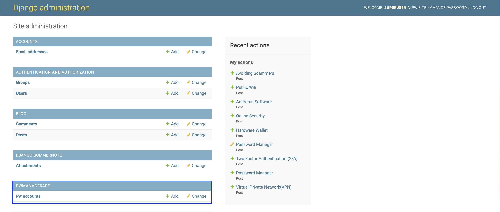

# Password Vault
(Developer: Christopher Faherty)

[Live Webpage]()

## About

The main focus of the Password Vault is to help users live a more secure life owhile online. This is accomplished by the password manager and blog with its security posts.

This password manager allows the user to sign up and store their account details. It then allows that users to view, add and edit their account details. It also allows users to read our monthly security blogs where we will be posting a blog about a n important security topic each month.

With the pace of everything going digital and everyone having different accounts for everything, its human nature to take the easy route and use the same password for every account. This has a huge impact on your security and shows why password managers are vital today more than ever.

Superuser details: 
User: superuser
Password: PasswordVault@2023

## Table of Contents

1. [Project Goals](#project-goals)
    1. [User Goals](#user-goals)
    2. [Site Owner Goals](#site-owner-goals)
2. [User Experience](#user-experience)
    1. [Target Audience](#target-audience)
    2. [User Requirements and Expectations](#user-requirements-and-expectations)
    3. [User Manual](#user-manual)
    4. [User Stories](#user-stories)
3. [Technical Design](#technical-design)
    1. [Flowchart](#flowchart)
4. [Technologies Used](#technologies-used)
    1. [Languages](#languages)
    2. [Framework and Tools](#framework-and-tools)
    3. [libraries](#libraries)
5. [Features](#features)
6. [Testing](#testing)
    1. [Validator Testing](#validator-testing)
    2. [Testing user stories](#testing-user-stories)
    3. [Unit Testing](#unit-testing)
8. [Bugs](#bugs)
9. [Deployment](#deployment)
10. [Credits](#credits)
11. [Acknowledgements](#acknowledgements)

## Project Goals

### User Goals
* Storing their account details (Username, Email & Password),
* View all their account details,
* Add new accounts as required,
* Edit the account details,
* Delete accounts,
* Be able to contact the admin,
* Be able to stay uptodate on the latest Security trends.

### Site Owner Goals
* Create a product that would improve the online security and awareness of its users,
* Create a design and ease of use flow that entices the users to return,
* Provide the ability to recieve feedback from its users,
* Provide a responsive design.

## User Experience

### Target Audience
* People that find it hard to remember a lot of passwords,
* People with a lot of online accounts,
* People looking to improve their online security,
* People intrested in learning more ways to improve their online security

### User Requirements and Expectations
* A home page with a call to action,
* A homepage with an overview of the site capabilities,
* A easy to follow flow of information,
* A easy to use nav bar,
* Account details displayed with easy access to username and password,
* An ability to contact Admin to change account details.

[Back to Table Of Contents](#table-of-contents)

### User Stories

#### First-time  User
1. I want to the password vault product to flow and be easy to follow,
2. I want to be able to create a user account and store my username & passwords for several online accounts,
3. I want to be able to navigate the site with ease and only relevant options being displayed to me,
4. I want to be able to view a list of all my stored accounts,
5. I want to be able to access my accounts to get the stored details,
6. I want to be able to edit and delete my stored accounts,
7. I want to be able to contact admin if i need to change my user details,
8. I want to be able to contact admin with blog suggestions,
9. I want to be able to read like and comment on the security blogs.

#### Site Owner
10. I want users to enjoy the experience while visiting the Password Vault,
11. I want users to easily navigate the site,
12. I want users to be able to use the functions with out an issue,
13. I want users to know how to contact the admin if there is an issue,
14. I want users to learn more about online security while on the site,
15. I want users to be able to interact with the monthly posts,
16. I want the site to be responsive,
17. I want users passwords to be hidden on the admin panel for security purposes,
18. I want to be able to get blog post suggestions from users,
19. I want to be able to get product feedback from users,
20. I want users to be able to follow my socials.

## Design

### Colours

The colour scheme was chosen to be easy on the eye but also highlight the seperate sections of the project. This allows the users to easly navigate the site. This color scheme was used for the entire project. 

The color scheme was created with the use of <a href="https://coolors.co/palette/e63946-f1faee-a8dadc-457b9d-1d3557">Coolors</a>

Coolor Pallet

### Fonts

The google fonts used in the project are Roboto and Lato. These were the main fonts. Sans-serif was used as the back up font.

### Structure

#### Website pages

The website was structured to allow for smooth navigation between the different pages.

The main navigation for the site is at the top of the page. It is on the left handside along with the title for the project. The menue collapes into a hamburger menu on small size screens. There is social links in the footer to lead to the github repo and my linkedin page.

- The website consists of the following sections:
  - Home page with a call to action section, Blog top hits and a features section,
  - The call to action is Dynamic depending on if the user is Authenticated or not. If the user is autenticated it will bring them to the accounts page, if not it will go to the sign up page,
  - The blog section on the home page displays the lastest 3 blog posts so when users visit the site they see the most up to date blogs,
  - The features section highlights the three main features of the site the blog, password vault and contact page with links to access the correct pages to find out more,
  - Blog page, this is where the users can read like and comment on all security blog posts.
  - The blog page will display up to 6 blogs and then after that it will paginate and display the rest on the next page. This is to keep the page user friendly,
  - The user can click into any blog they would like to read. 
  - Once the user is viewing the blog post they can like it and submit a comment to be reviewed by the admin before posting it, they can also read other comments,
  - Contact page allows the users to contact the admin, The email will get sent to the admin panel and also directly to the admins email address,
  - The register page allows new users to sign up for a new account,
  - The login page allows the users that have already registered to log into their accounts.
  - There are two pages to the password manager an accounts page where all fo your accounts are displayed,
  - In the accounts page the user can click on the account they want to view to get all the user details,
  - This allows the user to see the website, email, username & password,
  - The user name and password have copy to clipboard links to make it easy for them to get their details,
  - There is also a delete button where the user can delete their account, 
  - There is an edit button where the user can edit the details in their account and save it again,
  - The add account page allows the user to add a new account to their profile,
  - Login page for returning user to log in,
  - Logout page Brings the user to log out,
  - Contact page with contact form which allows users to send an email to the admin and provide their feedback.
  - 404 error page.

#### Database

- The backend consists of Python built with the Django framework with a database of a Postgres for the deployed version.

The following models were created to represent the database model structure for the website:

##### blog/Post Model

- Contains all the fields required for posting on the blog (Char, Slug, DateTime & Text),
- Contains a field to store blog posts in draft or published,
- Contains the field to add likes to the posts with a (ManyToManyField),
- Stores the images for the posts in cloudinary with a (CloudinaryField),
- Contains a ForeignKey Field to select the author of the blog post.

Show Model

##### blog/Comment Model

- Contains all the input fields required to comment on the blog posts (Char, Email, Text & DateTime),
- Contains a ForeignKey to send the comment to the admin panel for approval,
- Contains a BooleanField to see if the comment is approved before it is posted.

Show Model

##### pwmanagerapp/PwAccount Model

- Contains a User ForeignKey to connect a user to the account being stored,
- Contains the fields for the details a user would want to store for an account (Char & Email),
- Encrypts the password field while it is stored in the database (encrypt(CharFiedl)),
- Uses django_cryptography_fields to encrypt the password in the database and decrypt when it is being viewed by the user,
- Removed the password field from the admin panel to keep the users passwords secure.

Show Model

### Wireframes

##### Home Page

Logged in Page

Logged out Page

##### Blog

Main Page

Post Page

##### Contact

Contact Page

##### Password Manager

Add Account

View Accounts

View Account Details

##### Autentication

Register

Login

Logout

[Back to Table Of Contents](#table-of-contents)

## Technologies Used

### Languages and Frameworks

* [HTML]
* [CSS]
* [Javascript]
* [Bootstrap]
* [Python]
* [Django]

### Libraries and Tools

* [Git](https://git-scm.com/) Used for version control to push the code to GitHub.
* [GitHub](https://github.com/) Used as a repository to store the projects code.
* [Heroku Platform](https://www.heroku.com) Used to deploy the project.
* [Am I Responsive](https://ui.dev/amiresponsive) Used to get the responsive image at the top of the readme.
* [Balsamiq](https://balsamiq.com/) Used to create the wireframes.
* [Cloudinary](https://cloudinary.com/) Used to store the static files.
* [Favicon](https://favicon.io/) Used to generate a favicon for the site.
* [Font Awesome](https://fontawesome.com/) Used for the icons in the site.
* [Google Fonts](https://fonts.google.com/) Used for importing the fonts on the site.
* [Postgres](https://www.postgresql.org) Used as the database for the deployed site.
* [Summernote](https://summernote.org/) Used for the fields in the Admin panel.
* [ChatGPT](https://openai.com/blog/chatgpt/) Used to generate the content for the blog posts.
* [Cryptography](https://django-cryptography.readthedocs.io/en/latest/) Used to encrypt the users account passwords stored in the db.
* [Crispy Forms](https://django-crispy-forms.readthedocs.io/en/latest/) Used to generate the forms.
* [Freepik](https://www.freepik.com/) Subscription used for the blog and error page images.

### Validation Tools

* [WC3 Validator](https://validator.w3.org/) Used to validate the html code.
* [Jigsaw W3 Validator](https://jigsaw.w3.org/css-validator/) Used to validate the css code.
* [JShint](https://jshint.com/) Used to check the quality of the JavaScript.
* [PEP8](http://pep8online.com/) Used to check the code follows the coding conventions.
* [Lighthouse](https://developers.google.com/web/tools/lighthouse/) Used for for performance, accessibility, progressive web apps, SEO analysis.
* [Wave Validator](https://wave.webaim.org/) Used to evaluate accessibility.

[Back to Table Of Contents](#table-of-contents)

## Features

### Existing Features

* Logo and Navigation Bar
    * Remains consistant on all pages,
    * The logo is also used as a link back to the home page,
    * The navbar will change if the user is autenticated to display the logout and password manager links,
    * The password manager link uses a dropdown menu to save space,
    * User stories:

Logo & Nav bar Image

* Call to Action
    * The call to action gives the user an idea of what the site is about "Security is key",
    * It explains that the user can store passwords for different online accounts,
    * It has a link to bring a new user to sign up,
    * If the user is already signed up the call to action changes to bring the user to their stored accounts,
    * User stories: 

Call to Action Image

* Blog Highlight
    * This section gives the user a feel for what the blog is about,
    * The three most recent blogs will be displayed here for quick access,
    * Each highlighted blog post can be clicked to enter the main post,
    * User stories: 

Blog Highilght Image

* Features
    * The features section is used to display the main features of the website (Blog, Password Manager & Contact),
    * Each feature has explaination text and a link to the each each section,
    * By selecting the check it out button it will direct you to the representative page,
    * User stories:

Features Image

* Footer
    * The footer displays the name of the developer,
    * Two links are displayed to go to the github depositry or the developers linkedin page,
    * User stories:

Footer Image

* Blog Overview Page
    * To get to the blog page you click on the blog link in the nav bar,
    * The blog can be viewed by autherised and unautherised users,
    * The blog page displays 6 blog posts at a time,
    * If there are more than 6 postss a next button will apear at the bottom of the page to move to the next page to see more blog posts,
    * If you click on the post title it will bring you to the detailed post,
    * User stories:

Blog Image

 * Blog Post
    * To get to this point the user clicks on blog in the nav bar,
    * The user then clicks on the title of the blog post they want to view,
    * They are now in the detailed view where they can read the full post,
    * The user can like the post if they enjoyed it,
    * The user can add a comment as well and then after the admin approves it will be displayed under comments,
    * User stories:

Blog Post Image

 * Contact Page
    * To get to this point the user selects the contact link in the nav bar,
    * The user is presented with the contact form, 
    * This form can be used for requests, sugestions or assistance in changing details,
    * The email will get stored in the admin panel and will also be sent to the admins inbox,
    * User stories:

Contact Image

 * Add Account Page
    * To get to this point the user selects the password manager link dropdown in the nav bar,
    * Then select the add account link in the dropdown, 
    * This brings the user to the add account page where they can fill out the form to store their account details,
    * Once the form is filled out the user clicks add password,
    * The account details are now saved in the db where only the user can access them,
    * As this is a password manager the password field can't be seen by anyone but the user and it is encrypted in the database,
    * User stories:

Add Account Image

 * View Account Page
    * To get to this point the user selects the password manager link dropdown in the nav bar,
    * Then select the view account link in the dropdown, 
    * This brings the user to the view account page where they can see the title of all the accounts they saved,
    * The user can click on the account title link to see the account details,
    * User stories:

View Account Image

 * Account Detail Page
    * To get to this point the user selects the password manager link dropdown in the nav bar,
    * Then select the view account link in the dropdown, 
    * This brings the user to the view account page where they can see the title of all the accounts they saved,
    * The user then selects one of their saved accounts,
    * This displays that accounts details the user stored,
    * The user has copy to clipboard links for the usename and password for easy of use,
    * The user also has extra options (delete & edit),
    * User stories:

Account Detail Image

 * Edit Account Detail Page
    * To get to this point the user selects the password manager link dropdown in the nav bar,
    * Then select the view account link in the dropdown, 
    * This brings the user to the view account page where they can see the title of all the accounts they saved,
    * The user then selects one of their saved accounts,
    * This displays that accounts details the user stored,
    * The user then selects the edit button,
    * This brings the user to the edit page where they can edit their details,
    * Once the edits are complete the user can save the new details,
    * User stories:

Edit Account Detail Image

 * Delete Account Detail Page
    * To get to this point the user selects the password manager link dropdown in the nav bar,
    * Then select the view account link in the dropdown, 
    * This brings the user to the view account page where they can see the title of all the accounts they saved,
    * The user then selects one of their saved accounts,
    * This displays that accounts details the user stored,
    * The user then selects the delete button,
    * This deletes that account from the users profile and reverts back to the view accounts page,
    * User stories:

Delete Account Detail Image

 * Register Page
    * To get to this point the user selects the register link in the nav bar,
    * The user can then fill in their details to register a new account,
    * The user also has the option to head back to the home page,
    * This page was restrained to keep it simple for the user with its 2 main options,
    * User stories:

Register Image

 * Login Page
    * To get to this point the user will click on the login link in the nav bar,
    * The login link will only be displayed when the user is not logged in,
    * The login page then allows the user to enter their details and log in,
    * The user can also select remember me to speed up the login process in the future,
    * User stories:

Login Image

* Logout Page
    * To get to this point the user will click on the logout link in the nav bar,
    * The logout link will only be displayed when the user is logged in,
    * The logout page then asks the user if they want to logout,
    * The user can also return to the home page with the return home button,
    * User stories:

Logout Image

[Back to Table Of Contents](#table-of-contents)

## Testing

* Testing was condicted in three ways.
    * Testing the code with the pycodestyle extension.
    * Testing the code manually with the user stories.
    * Testing the password validation code with unit testing.

### Validator Testing
* The W3C Markup Validation Service was used to validate the HTML of the website.

    

Home

    
    

    

Blog

    
    

    

Contact

    
    

    

Success

    
    

    

View

    
    

    

Create

    
    

    

Register

    
    

    

logout

    
    

    

login

    
    

* The W3C Jigsaw CSS Validation Service was used to validate the CSS of the website. When validating all website, it passes with no errors.

    

CSS Validator

    
    

* JSHint JS Validation Service was used to validate the Javascript files. No errors were found.

    

JavaScript Validator

    
    

* Note - PEP8 no longer offers their validation services 'pycodestyle' installed in my workspace to validate the code

    

PEP8 Validator

    
    

* Chrome Developet Tools Lighthouse

    

Home

    
    

    

Blog

    
    

    

Blog Details

    
    

    

Contact

    
    

    

Success

    
    

    

View

    
    

    

Create

    
    

    

Register

    
    

    

Login

    
    

    

Logout

    
    

### Testing user stories
1. I want to the password vault product to flow and be easy to follow.

| **Feature** | **Action** | **Expected Results** | **Actual Result** |
|-------------|------------|----------------------|-------------------|
| Main screen | Scroll to the top of the page | User is presented with a Nav Bar and all the page links | Works as expected |
| Nav bar| Click register | The user is taken to the registeration page | Works as expected |
| Registeration page | The user inputs their details and clicks sign up | The user is loged in and taken back to the main page | Works as expected |
| Nav bar | The user views the navbar | Nav bar has changed with the new revelent links | Works as expected |

Screenshots

2. I want to be able to create a user account and store my username & passwords for several online accounts.

| **Feature** | **Action** | **Expected Results** | **Actual Result** |
|-------------|------------|----------------------|-------------------|
| Main screen | Scroll to the top of the page | User is presented with a Nav Bar and all the page links | Works as expected |
| Login | Click login in the nav bar | User is taken to the login screen | Works as expected |
| Login screen | Input login details | User is asked to imput its username and password | Works as expected |
| Navbar | The navbar now displays the password manager link | The user clicks on the password manager link and it displays two options | Works as expected |
| Navbar | User clicks add account | User is taken to the add account page | Works as expected |
| Add account | User can input account details | Users details are stored and user is taken to the view accounts | Works as expected |
| View Accounts | User is redirected to the view accounts | All stored accounts are displayed | Works as expected |

Screenshots

3. I want to be able to navigate the site with ease and only relevant options being displayed to me,

| **Feature** | **Action** | **Expected Results** | **Actual Result** |
|-------------|------------|----------------------|-------------------|
| Main screen | Scroll to the top of the page | User is presented with a Nav Bar and all the page links and a call to action | Works as expected |
| Nav bar| Click register | The user is taken to the registeration page | Works as expected |
| Registeration page | The user inputs their details and clicks sign up | The user is loged in and taken back to the main page | Works as expected |
| Nav bar | The user views the navbar & call to acction | Nav bar  & call to action has changed with the new revelent links | Works as expected |

Screenshots

4. I want to be able to view a list of all my stored accounts,

| **Feature** | **Action** | **Expected Results** | **Actual Result** |
|-------------|------------|----------------------|-------------------|
| Main screen | Scroll to the top of the page | User is presented with a Nav Bar and all the page links and a call to action | Works as expected |
| Login | click the login link | User is taken to the login screen | Works as expected |
| Login screen | Input username & password | User is taken back to the home page | Works as expected |
| Main screen | Click view accounts in the call to action | User is taken to the view accounts page | Works as expected |

Screenshots

5. I want to be able to access my accounts to get the stored details,

| **Feature** | **Action** | **Expected Results** | **Actual Result** |
|-------------|------------|----------------------|-------------------|
| Main screen | Scroll to the top of the page | User is presented with a Nav Bar and all the page links and a call to action | Works as expected |
| Login | click the login link | User is taken to the login screen | Works as expected |
| Login screen | Input username & password | User is taken back to the home page | Works as expected |
| Main screen | Click view accounts in the call to action | User is taken to the view accounts page | Works as expected |
| View Accounts | Click on the account to view | User is taken to the account details | Works as expected |

Screenshots

6. I want to be able to edit and delete my stored accounts,

| **Feature** | **Action** | **Expected Results** | **Actual Result** |
|-------------|------------|----------------------|-------------------|
| Main screen | Scroll to the top of the page | User is presented with a Nav Bar and all the page links and a call to action | Works as expected |
| Login | click the login link | User is taken to the login screen | Works as expected |
| Login screen | Input username & password | User is taken back to the home page | Works as expected |
| Main screen | Click view accounts in the call to action | User is taken to the view accounts page | Works as expected |
| View Accounts | Click on the account to view | User is taken to the account details | Works as expected |
| Account Details | Click on the delete or edit button | The user is taken to the delete or edit account page | Works as expected |

Screenshots

7. I want to be able to contact admin if i need to change my user details,  

| **Feature** | **Action** | **Expected Results** | **Actual Result** |
|-------------|------------|----------------------|-------------------|
| Main screen | Scroll to the top of the page | User is presented with a Nav Bar and all the page links and a call to action | Works as expected |
| Contact | Click the contact link | User is taken to the contact screen | Works as expected |
| Contact | Fill out the form and press send | A success message is displayed | Works as expected |

Screenshots

8. I want to be able to contact admin with blog suggestions,

| **Feature** | **Action** | **Expected Results** | **Actual Result** |
|-------------|------------|----------------------|-------------------|
| Main screen | Scroll to the top of the page | User is presented with a Nav Bar and all the page links and a call to action | Works as expected |
| Contact | Click the contact link | User is taken to the contact screen | Works as expected |
| Contact | Fill out the form and press send | A success message is displayed | Works as expected |

Screenshots

9. I want to be able to read like and comment on the security blogs.

| **Feature** | **Action** | **Expected Results** | **Actual Result** |
|-------------|------------|----------------------|-------------------|
| Main screen | Scroll to the top of the page | User is presented with a Nav Bar and all the page links | Works as expected |
| Navbar| Click on the blog link | User is taken to the blog page | Works as expected |
| Blog | Click on the blog post title | User is taken to the blog posts page | Works as expected |
| Blog Post | Click on the link heart to like or input a comment and press submit to send it for approval | The heart annimates or a success message is displayed for the comment | Works as expected |

Screenshots

10. I want users to enjoy the experience while visiting the Password Vault,

| **Feature** | **Action** | **Expected Results** | **Actual Result** |
|-------------|------------|----------------------|-------------------|
| Main screen | Scroll to the top of the page | User is presented with a Nav Bar and all the page links | Works as expected |
| Nav bar| Click register | The user is taken to the registeration page | Works as expected |
| Registeration page | The user inputs their details and clicks sign up | The user is loged in and taken back to the main page | Works as expected |
| Nav bar | The user views the navbar | Nav bar has changed with the new revelent links | Works as expected |
| Main page | Scroll through | The user is presented with all the features of the site in bite size view | Works as expected |

Screenshots

11. I want users to easily navigate the site,

| **Feature** | **Action** | **Expected Results** | **Actual Result** |
|-------------|------------|----------------------|-------------------|
| Main screen | Scroll to the top of the page | User is presented with a Nav Bar and all the page links | Works as expected |
| Nav bar| Click register | The user is taken to the registeration page | Works as expected |
| Registeration page | The user inputs their details and clicks sign up | The user is loged in and taken back to the main page | Works as expected |
| Nav bar | The user views the navbar | Nav bar has changed with the new revelent links | Works as expected |
| Main page | Scroll through | The user is presented with all the features of the site in bite size view | Works as expected |

Screenshots

12. I want users to be able to use the functions with out an issue,

| **Feature** | **Action** | **Expected Results** | **Actual Result** |
|-------------|------------|----------------------|-------------------|
| Main screen | Scroll to the top of the page | User is presented with a Nav Bar and all the page links | Works as expected |
| Main page | Scroll through to features | The user is presented with all the features of the and an explanation | Works as expected |

Screenshots

13. I want users to know how to contact the admin if there is an issue,

| **Feature** | **Action** | **Expected Results** | **Actual Result** |
|-------------|------------|----------------------|-------------------|
| Main screen | Scroll to the top of the page | User is presented with a Nav Bar and all the page links and a call to action | Works as expected |
| Contact | Click the contact link | User is taken to the contact screen | Works as expected |
| Contact | Fill out the form and press send | A success message is displayed | Works as expected |

Screenshots

14. I want users to learn more about online security while on the site,

| **Feature** | **Action** | **Expected Results** | **Actual Result** |
|-------------|------------|----------------------|-------------------|
| Main screen | Scroll to the top of the page | User is presented with a Nav Bar and all the page links | Works as expected |
| Navbar| Click on the blog link | User is taken to the blog page | Works as expected |
| Blog | Click on the blog post title | User is taken to the blog posts page | Works as expected |

Screenshots

15. I want users to be able to interact with the monthly posts,

| **Feature** | **Action** | **Expected Results** | **Actual Result** |
|-------------|------------|----------------------|-------------------|
| Main screen | Scroll to the top of the page | User is presented with a Nav Bar and all the page links | Works as expected |
| Navbar| Click on the blog link | User is taken to the blog page | Works as expected |
| Blog | Click on the blog post title | User is taken to the blog posts page | Works as expected |
| Blog Post | Click on the link heart to like or input a comment and press submit to send it for approval | The heart annimates or a success message is displayed for the comment | Works as expected |

Screenshots

16. I want the site to be responsive,

| **Feature** | **Action** | **Expected Results** | **Actual Result** |
|-------------|------------|----------------------|-------------------|
| Main screen | Open on a mobile | User is presented with a responsice design | Works as expected |

Screenshots

17. I want users passwords to be hidden on the admin panel for security purposes,

| **Feature** | **Action** | **Expected Results** | **Actual Result** |
|-------------|------------|----------------------|-------------------|

| Admin Screen | Add /admin to the url | User is taken to the admin panel if they are a superuser| Works as expected |
| Admin Screen | Click on Pw Accounts | User is presented with all the users accounts | Works as expected |
| Pw Accounts | Click on an account | User is presented with the account details but the passwortd is not displayed | Works as expected |

Screenshots

18. I want to be able to get blog post suggestions from users,

| **Feature** | **Action** | **Expected Results** | **Actual Result** |
|-------------|------------|----------------------|-------------------|
| Main screen | Scroll to the top of the page | User is presented with a Nav Bar and all the page links and a call to action | Works as expected |
| Contact | Click the contact link | User is taken to the contact screen | Works as expected |
| Contact | Fill out the form  with the blog idea and press send | A success message is displayed | Works as expected |

Screenshots

19. I want to be able to get product feedback from users,

| **Feature** | **Action** | **Expected Results** | **Actual Result** |
|-------------|------------|----------------------|-------------------|
| Main screen | Scroll to the top of the page | User is presented with a Nav Bar and all the page links and a call to action | Works as expected |
| Contact | Click the contact link | User is taken to the contact screen | Works as expected |
| Contact | Fill out the form with your feedback and press send | A success message is displayed | Works as expected |

Screenshots

20. I want users to be able to follow my socials.

| **Feature** | **Action** | **Expected Results** | **Actual Result** |
|-------------|------------|----------------------|-------------------|
| Main screen | Scroll to the bottom of the page | User is presented with a footer and all the social links | Works as expected |
| Footer | Clicks on a social link | Opens a new page with the social | Works as expected |

Screenshots

[Back to Table Of Contents](#table-of-contents)

### Unit Testing

#### Password validator

* These unit tests were writen using the unittest library.
* They are to check if a password is long enough and if the password is valid.

##### Valid password

* This unit test was writed to check if the code below is working correctly and checking if they are valid.
* A valid password must be 8+ characters and have at least 1 of each of the following:
    * Uppercase,
    * Lowercase,
    * Digit,
    * Special character "@$_".
* The unit test inputs in 6 different tests and they app passed.

Screenshots

##### Password length

* This unit test was writed to check if the code below is working correctly and checking the length is valid.
* The valid length password is 8 characters or more.
* The unit test inputs in 4 different tests and they passed. 

Screenshots

## Bugs

### Fixed Bugs
* When working to encrypt the users passwords in the database so the admin couldn't see it. It would remain decrypted in the admin panel.
    * FIX: The password field was excluded from the admin panel so it is not secuer and encrypten in the db as well.
* When trying to add an email feed back for the contact form I was using twillio but it required a domain name.
    * FIX: Moved to Google SMTP for the email and edited the settings.py file to work for in the terminal for development and send an email in the deployed version.
* When adding the 3 blog posts to the home page there was issues connecting the apps together.
    * FIX: this was salved by adding app names to urls.py for both the blog and home app.
* When ad ing the encryption to my models it was presenting an error that the column did not exsist in the database.
    * FIX: the db was deleted along eith the migration files except for the __init__.py file. This is not recomended if your site is deployed with importand data stored in the database.

## Deployment

### Deploying to Heroku
* Go to the heroku.com site.
    

Screenshots

    
* Click the signup button in the top right.
    

Screenshots

    
* Create an account on heroku.com,
    

Screenshots

    
* Confirm your account in the email heroku sent to your inbox,
    

Screenshots

    
* Create a password,
    

Screenshots

    
* Click and proceed,
    

Screenshots

    
* Accept the terms of service,
    

Screenshots

    
* Create a new app, create a name for your app "ci_pp3_ppm" and choose your region,
    

Screenshots

    
* Go to the settings section,
    

Screenshots

    
* Click Reveal Config Vars,
    

Screenshots

    
* Input your .json file. name in the 'Key' field, copy the .json file and paste it in 'Value' field. Also add a key 'PORT' and value '8000'.
    

Screenshots

    
* In the build packs section click add buildpack. For this project, I added 2 buildpacks 'Python' and 'node.js'. Make sure the Python build pack is above the Nodejs buildpack.
    

Screenshots

    
* Go to "Deploy" in "Deployment method" select "GitHub",
    

Screenshots

    
* Click 'Search' (Enter in your projects name that you have in your github repositry)and then 'Connect'. This project is connected to Chrisfaherty/CI_PP3_PPM.
    

Screenshots

    
* Choose the branch you want to buid your app from "main" .
* If prefered, click on "Enable Automatic Deploys", which keeps the app up to date when you push to git hub. Automatic deployments is turned on for this project.
    

Screenshots

    
* If the project doesn't deploy after selecting automatic deploy . In the Manual deploy section click Deploy Branch to deploy your code, this is what I had to do.
    

Screenshots

    
* Once the code is deployed it will show a button that you can click to view the deployed site. Then the project has sucessfully been deployed.

### Forking the GitHub Repository
* Go to the GitHub repository,
* In the top right hand corner you can click on the fork button,
* This will fork the repositry.

## Credits
* The Code Institute sections.
    * Buiding with Bootstrap - Used for insperation on the bootstrap code, and the home page,
    * Hello Django - Used for insperation for the password manager,
    * I Think Therefore I Blog - Used for insperation for the blog & contact page,
* [Tech with Tim](https://www.youtube.com/watch?v=Z4D3M-NSN58&list=PLzMcBGfZo4-kQkZp-j9PNyKq7Yw5VYjq9) For the inspiration to create a password manager.
* [Freepix](https://www.freepik.com/) Used for the images in the blog posts and error pages,
* [Chat GPT](https://openai.com/blog/chatgpt/) Used for the content in the blog posts,
* [Richard Taujenis](https://python.plainenglish.io/build-a-password-storage-app-with-django-part-i-c6991e97e320) For the guidance on the password manager.
* [Securecoding](https://www.securecoding.com/blog/cryptography-for-security-in-django-app/) For guidance on password encryption.

## Acknowledgements
I would like to take the opertunity to thank:
* My Mentor Mo Shami for the great feedback productive meetings and guiding me to finishing this project.
* I would also like to thank the Code institute team for all the support and material to assist with this project.
* The code institute Tutors for being available when ever guidance was required.
* I would like to thank Nick Coles & Chris Browning for the help with problem solving and independant reviews.

[Back to Table Of Contents](#table-of-contents)
